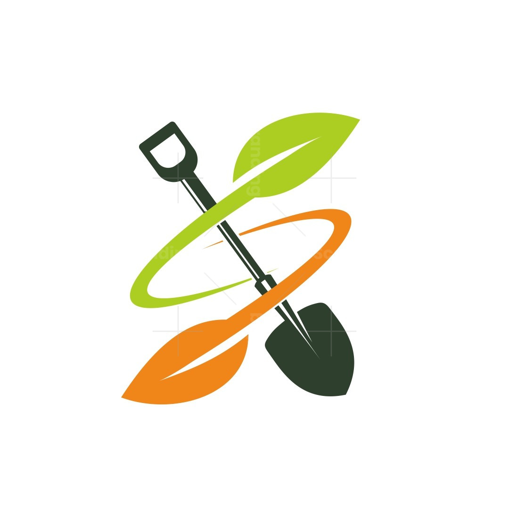

<!DOCTYPE html>
<html lang="en">
<head>
  <meta charset="UTF-8">
  <meta name="viewport" content="width=device-width, initial-scale=1.0">
  <title>MarketX.com</title>
  
</head>
<body>

  <!-- Header -->
  <header>
    
MarketX

    

      <button onclick="goToLogin('admin')">Admin Login</button>
      <button onclick="goToLogin('customer')">Customer Login</button>
      <button id="addProductBtn" style="display:none;" onclick="window.location.href='product.html'">Add Product</button>
      <button id="logoutBtn" style="display:none;" onclick="logoutAdmin()">Logout</button>
    

  </header>

  <!-- Search Bar -->
  

    <input type="text" id="searchInput" placeholder="Search Product/Category/Brand...">
    <button onclick="searchProducts()">Search</button>
  

  <!-- Categories -->
  <section class="categories" id="categories-section">
    
<h3>Power Tools</h3>

    
<h3>Electricals</h3>

    
<h3>Appliances & Utilities</h3>

    
<h3>Safety</h3>

    
<h3>Medical Supplies</h3>

    
<h3>Office Supplies</h3>

    
<h3>Gardening</h3>

    
<h3>Security</h3>

    
<h3>Plumbing & Fittings</h3>

  </section>

  <!-- Products Section -->
  

  <!-- Footer -->
  <footer>
    
© 2025 MarketX. All Rights Reserved.

  </footer>

</body>
</html>
